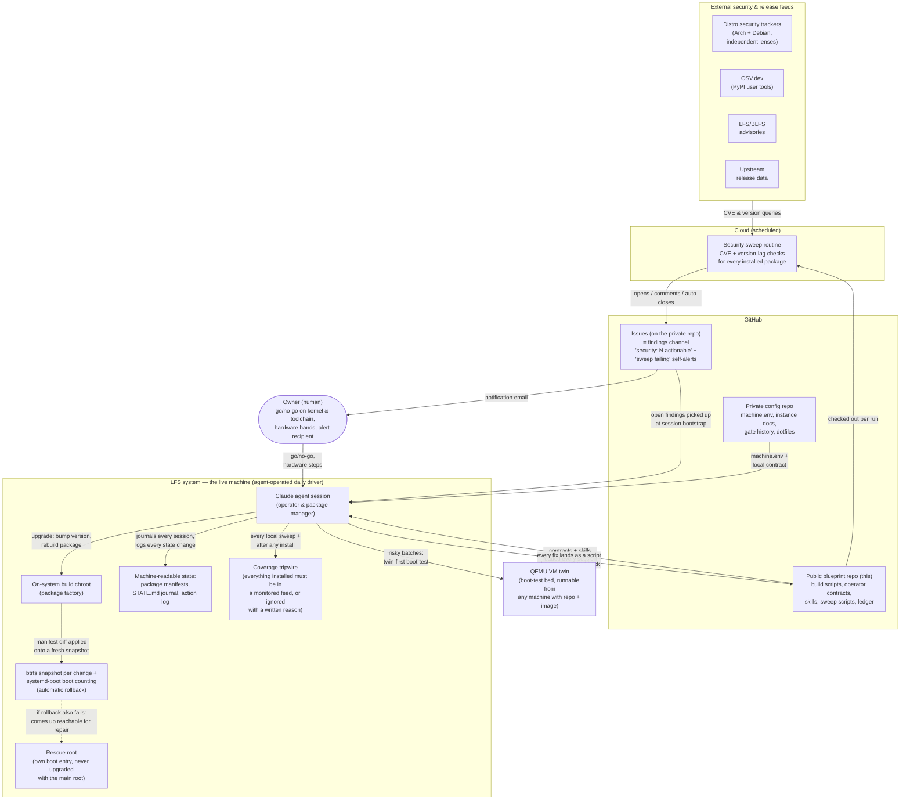

<p align="center">
  
</p>

A [Linux From Scratch](https://www.linuxfromscratch.org/) (LFS 13.0,
systemd) system that is built **and operated** by an AI agent.

Linux From Scratch normally means compiling an entire Linux system from
source by hand, following the LFS book step by step. This project goes
two steps further:

1. **Everything is scripted.** Every package is a small, reproducible
   build script. Every installed file is tracked in a manifest. Every
   downloaded source is checked against a pinned hash before it is
   allowed anywhere near the build.
2. **An agent runs the system.** Claude (via Claude Code) does the
   builds, upgrades, security monitoring, and boot testing under
   written contracts (CLAUDE.md, OPERATIONS.md, AGENT-DESIGN.md). The
   human owner stays in the loop for exactly two things: go/no-go on
   kernel and toolchain changes, and anything that needs physical
   hands.

The result is not a toy. It boots a real laptop and is used as a daily
driver.

## Quickstart

**Reading.** [OPERATIONS.md](OPERATIONS.md) is the operating model —
how a source-built system stays a viable daily driver.
[CLAUDE.md](CLAUDE.md) is the contract the agent operates under,
[AGENT-DESIGN.md](AGENT-DESIGN.md) the register of every deviation
from the LFS book, [PROVENANCE.md](PROVENANCE.md) the supply-chain
rules. For how this feels in practice, start with the
[case studies](case-studies/) — real diagnosis chains from operating
the system, written up as transferable patterns.

**Operating with an agent** (the intended mode):

```sh
git clone https://github.com/felixbrock/agent-lfs.git ~/repos/agent-lfs
cd ~/repos/agent-lfs
claude    # Claude Code picks up CLAUDE.md as its operator contract
```

The repo is written to be self-sufficient for an agent: telling it
"build this system" — or, on a built one, `/lfs-status` — is enough.
The operator contract, the vendored book pages, the scripts, and the
step-by-step skills (`.claude/skills/`: `/lfs-status`, `/lfs-upgrade`,
`/lfs-sweep`) carry the procedure; the hash ledger and file manifests
keep it honest. Two caveats: use a flagship model (this system was
built and is operated with Claude's frontier tier, currently Fable 5 —
a days-long autonomous build is exactly where weaker models drift),
and expect to stay in the loop for root commands and go/no-go calls —
the contract makes the agent hand those to you rather than guess.

Not a Claude Code user? The contract is agent-agnostic and mirrored
at [AGENTS.md](AGENTS.md), the convention read by
[Codex CLI](https://github.com/openai/codex),
[Hermes Agent](https://github.com/NousResearch/hermes-agent)
(open source, self-hostable), and most other coding agents. The
skills are plain markdown — point your agent at
`.claude/skills/*/SKILL.md` when a procedure applies. The same model
rule holds: run whichever agent on the strongest model you have.

Everything machine-specific (device paths, VM access, issues repo) is
sourced from a private sibling config repo at `$LFS_CONFIG` (default
`~/repos/lfs-config`) — create your own with a `machine.env`; the
blueprint never needs editing for instance values (see
[Three-repo split](#three-repo-split)).

**Building the system by hand.** The same path the agent takes — the
LFS book, as scripts. Expect days of compile time and a human in the
loop for root steps:

1. Host prerequisites per LFS 13.0 ch. 2–3 (the exact book pages the
   scripts were derived from are vendored under `book/` and alongside
   each script), then `sudo scripts/prep-ch4.sh` — creates `/mnt/lfs`
   and the unprivileged `lfs` build user.
2. Stage sources into `/mnt/lfs/sources` — every artifact must first
   pass `scripts/verify-source.sh` against the pinned sha256 ledger
   (`ops/sources-sha256.txt`).
3. Run the chapters in order: `build/ch5/run-all.sh` and
   `build/ch6/run-all.sh` as the `lfs` user; `sudo scripts/prep-ch7.sh`
   (read its security note first) installs the chroot helper for
   `build/ch7` and `build/ch8`; chapter 9's configuration scripts and
   the BLFS desktop tiers (`build/blfs/`) follow. Every package script
   is stamped and writes a file manifest, so reruns are surgical.
4. Boot-test the result in QEMU: `scripts/vm-up.sh` (`--display` for a
   window), `scripts/vm-down.sh` to shut it down safely.

## Status (2026-07-17)

**The system runs on real hardware.** The build passed three
verification gates (base build, desktop replication, daily-driver
sign-off). The current phase is dual-boot: the system boots the
owner's laptop from a LUKS2-encrypted microSD card via UEFI/GRUB and a
purpose-built initramfs — with working GPU acceleration (Mesa iris),
Wi-Fi, Bluetooth, NetworkManager, and Claude Code running *on* the LFS
system itself. The card is the live system and source of truth; the
original Arch Linux install remains as build host and safety net until
a final backup and sign-off retires it.

## How it works

The repo is the single source of truth. Every package is a build
script, every deviation from the LFS book is registered, and the
running system never diverges from what is committed here. The agent
operates around that spec in three roles:

- **Package manager** — build a new version in the chroot, diff the
  file manifests, apply the diff, boot-test, promote.
- **Security monitor** — a scheduled cloud routine sweeps CVE trackers
  and release feeds for every installed component (~290 tracked).
- **Incident responder** — open security findings are picked up at the
  start of every session and driven to a committed fix.

Day to day, that looks like this:

- Packages are built either in a chroot on the build host (batches are
  applied to the live card via manifest copies,
  `build/gated/apply-card.sh`) or natively on the live system
  (`scripts/live-run-all.sh` — same hash gate, stamps, and manifests).
- A QEMU VM twin boot-tests risky changes before they touch the real
  system.
- Two agent instances cooperate — one on the build host, one on the
  live LFS system — coordinated through an on-machine journal
  (`/var/lib/agent/STATE.md`) and this repo.

The diagram shows the target operating model for the next phase, when
the system moves to the permanent internal disk (snapshots, boot
counting, and the rescue root exist in that design — see
AGENT-DESIGN.md D1–D3 — but not yet on the microSD):



The pieces, in plain terms:

- **The repo is the spec.** Build scripts (`build/*/NNN-pkg.sh`), the
  operator contract (CLAUDE.md), the divergence register
  (AGENT-DESIGN.md), the operating model (OPERATIONS.md), and the
  agent's step-by-step procedures (`.claude/skills/`) all live here.
  Every fix lands as a script change first and is applied second —
  never the reverse. That keeps the system reproducible: nothing on
  the machine exists that the repo can't explain.
- **Security monitoring that matches the software.** A scheduled cloud
  routine checks every class of installed software the way that class
  needs: source packages are CVE-checked against the Arch *and* Debian
  security trackers (two independent triage lenses); vendor binaries
  like browsers are checked for version lag, because for those staying
  current *is* the security control; user-level Python tools are
  queried against OSV.dev; LFS/BLFS advisories serve as remediation
  recipes. Findings arrive as GitHub issues. If the sweep
  infrastructure itself breaks, that raises its own issue — so a quiet
  day genuinely means a clean day.
- **Coverage as a closed loop.** Monitoring is only as good as its
  inventory. A deterministic tripwire (`scripts/coverage-check.sh`)
  compares everything actually installed on the system against the
  union of everything monitored. Anything unaccounted for is flagged
  until it gets a feed mapping or a written ignore reason. Gaps can
  exist, but they can't persist silently — its very first run caught a
  completely unmonitored Chrome install.
- **Issue → fix loop.** Every session starts by listing open security
  issues. The agent triages, upgrades the affected package, boot-tests,
  promotes, commits, and closes the issue.
- **Safe changes on a live machine** (target model). Every upgrade
  batch goes onto a fresh btrfs snapshot; systemd-boot boot counting
  promotes it after a successful boot or automatically falls back to
  the previous known-good entry. If even the fallback fails, a minimal
  rescue root — its own boot entry, never upgraded together with the
  main root — comes up reachable over SSH so the agent can repair the
  system without physical hands.
- **The machine remembers.** The system carries its own state: a
  journal (STATE.md), an append-only action log, and per-package file
  manifests. Any future session can reconstruct where things stand
  without relying on chat history. The action log's append-only
  property is kernel-enforced (`chattr +a`): the agent writes its own
  audit trail but cannot rewrite it.

## Case studies

Operating a source-built daily driver generates the best teaching
material there is: real failures, diagnosed to root cause, with the
dead ends left in. Selected episodes are published in
[case-studies/](case-studies/) after the fact — past-tense, curated,
and deliberately delayed for anything security-relevant. The public
repo teaches the timeless; live operational state never appears here
(see the split below for why).

- [001 — The touchpad that insisted it was a mouse](case-studies/001-touchpad-enumeration.md):
  four kernel revisions from "PS/2 Generic Mouse" to a real multitouch
  device, with two Kconfig traps and the config-verify-gate pattern
  that catches them.
- [002 — The GPU that was dark for days](case-studies/002-the-gpu-that-was-dark.md):
  a desktop software-rendered on the CPU for its entire life, and the
  initramfs-firmware rule that explains why.
- [003 — The invisible LUKS prompt](case-studies/003-the-invisible-luks-prompt.md):
  a one-line change exposes a boot-console gap that had been latent for
  ten kernel revisions, held harmless by coincidence.
- [004 — The build environment richer than the machine](case-studies/004-the-build-env-richer-than-the-machine.md):
  three dependencies that hid in the chroot until the target had to
  build for itself — why "prove the native pipeline" is a real gate.
- [005 — Operating a personal machine in public without leaking it](case-studies/005-operating-in-public-without-leaking.md):
  the accumulation threat model, the three-repo split, and why a
  mechanical leak gate beats a sanitization checklist.

## Three-repo split

The system is defined across three repositories:

- **agent-lfs** (this repo — the blueprint): architecture, build
  scripts, operator contracts, agent skills, sweep machinery, and
  case studies. Everything needed to build and operate *an*
  agent-driven LFS system, tied to no particular machine or person.
- **lfs-ops** (private — the operations log): the concrete machine's
  operational lineage — kernel revision scripts with their hardware
  narratives, migration and incident records, current package state.
  Kept private on purpose: a complete, current, attributed operations
  log of a personal machine is a targeting dossier, however
  instructive its episodes are. The episodes graduate to public case
  studies once cold and sanitized.
- **lfs-config** (private — the instance): everything a fresh session
  must read to operate this concrete system — hardware identifiers
  (`machine.env`), personal dotfiles, verification state,
  credentials policy.

All three are checked out as siblings. Blueprint scripts and skills
find the config half via `$LFS_CONFIG` (default `~/repos/lfs-config`)
and source `machine.env` from there, which in turn points at the ops
repo (`LFS_OPS`) and the live ledger (`LFS_LEDGER`). Instance
operations are RUN FROM the ops repo, so their machinery and ledger
resolve privately. To run your own system from this blueprint, create
your own private config and ops repos — the blueprint never needs
editing for machine-specific values, and your operational history
never needs publishing.

## Provenance

Every artifact — source tarball, Python wheel, vendor package, static
binary — passes a deterministic gate (`scripts/verify-source.sh`)
before it may be staged or built. Known artifacts must byte-match the
committed sha256 ledger (`ops/sources-sha256.txt`, 400+ pins). New
artifacts need an independently published hash (LFS/BLFS book or
upstream) and are then pinned permanently. A mismatch is treated as a
supply-chain event, not an inconvenience.

Sources come only from canonical upstream hosts; binaries only from
vendor-official endpoints (the full table and known limitations are in
PROVENANCE.md). If you reproduce this system, the ledger guarantees
you build from the exact bytes this system was built and boot-tested
from.

## Next steps

**Upstream the fixes.** Findings from the build that belong in
upstream trackers or the LFS dev list:
   - yajl 2.1.0: CMake 4 incompatibility (LOCATION property removal);
     fixed here by trimming tool/test subdirs +
     CMAKE_POLICY_VERSION_MINIMUM (build/blfs/scripts/130-yajl.sh)
   - i3blocks 1.5: `make install` race under parallel make
     (install-data-local rename; needs -j1 —
     build/blfs/scripts/133-i3blocks.sh)
   - unzip60: unbuildable with GCC 15's C23 default; documented
     libarchive replacement path (build/blfs/scripts-gatec/203-unzip.sh)
   - XML-Parser 2.54: new hard runtime deps (File::ShareDir chain)
     that the LFS book will hit at its next edition
     (build/ch8/425-427*.sh)
   - GCC 15.2 pass 1 under a GCC 16 host: libcody u8"" / C++20
     breakage, pass-1-only gnu++17 pin (build/ch5/20-gcc-pass1.sh)

## License

The original work in this repository (build scripts, operator
contracts, skills, sweep machinery, documentation) is MIT-licensed —
see [LICENSE](LICENSE).

The vendored HTML pages under `build/` and the files under `book/` are
unmodified excerpts from the [Linux From Scratch](https://www.linuxfromscratch.org/lfs/)
and [Beyond Linux From Scratch](https://www.linuxfromscratch.org/blfs/)
books, copyright © Gerard Beekmans and the LFS/BLFS development teams,
and remain under the books' own licenses (Creative Commons
Attribution-NonCommercial-ShareAlike for the text, MIT for the
computer instructions). They are included as the working reference the
build scripts were derived from.
